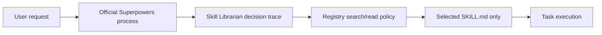

# Architecture

Agentic Skill Library is a verified, on-demand library. It is not an agent
framework, marketplace, or automatic skill installer.

## Four layers

| Layer | Owner | Responsibility | Does not do |
| --- | --- | --- | --- |
| Process | Official Superpowers | Planning, TDD, debugging, review, and verification | Select domain skills or weaken registry policy |
| Routing | Skill Librarian | Search, select, and compose relevant domain skills by phase; return a decision trace | Automatically execute skills, run scripts, or grant permissions |
| Trust | Registry CLI | Enforce state, risk, provenance, containment, symlink, and tree-hash policy | Decide whether a skill is semantically useful |
| Knowledge | Catalog and discovery index | Preserve skill snapshots and compact searchable metadata | Native-install the catalog or declare records safe |

The Librarian may load at most five domain skills concurrently in one phase. A
task may have later phases; each starts with a new decision trace and carries
only needed output forward, never the previous phase's complete instructions.
Official Superpowers process skills are outside that domain-skill quota.

## Trust boundaries

`registry/skills.json` is authoritative for identity, state, risk, provenance,
path, and content hash. `librarian-index.json` is discovery metadata only. A
search result never grants permission to read instructions. `skill-registry
read` independently checks the record and current catalog tree before returning
one selected `SKILL.md`.

The native-Librarian integration manifest and lock detect drift in the one
native integration file. They do not replace catalog provenance, content hash,
risk, Core admission, or quarantine policy.

## Non-goals

This architecture does not include ag-kit-style personas, slash-command
workflows, an MCP server, a memory engine, embeddings, vector databases, a GUI,
a marketplace, or bulk installation. Native installation is limited to
`skills/skill-librarian`; catalog snapshots remain repository data until the
Librarian policy-gates an individual read.
